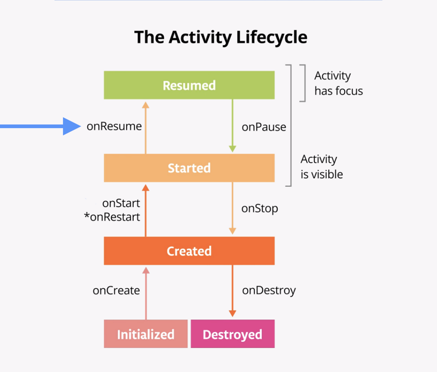
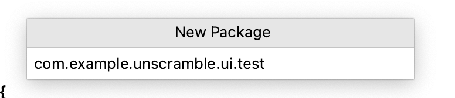
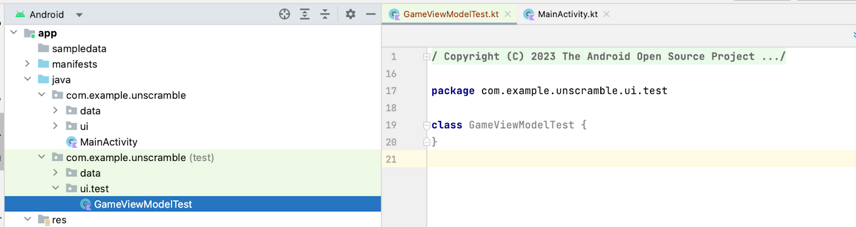
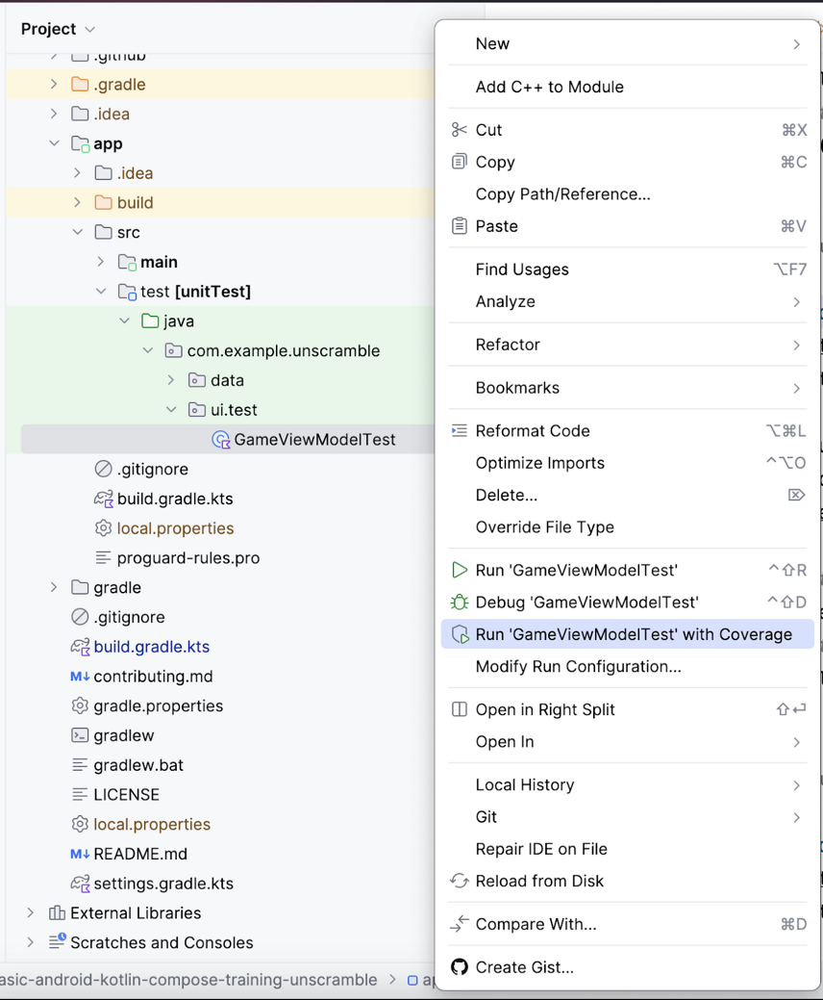
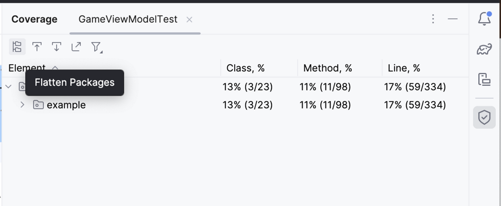
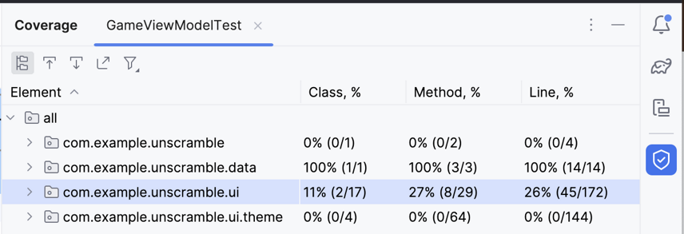
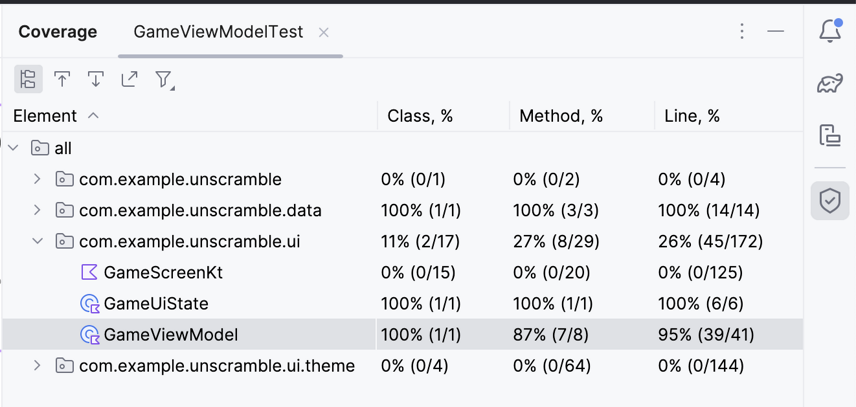

# 架构组件

> 实例代码： https://github.com/google-developer-training/basic-android-kotlin-compose-training-unscramble/tree/main

## 生命周期

- 日志输出
```java
private const val TAG = "MainActivity"
override fun onCreate(savedInstanceState: Bundle?) {
        Log.d(TAG, "onCreate Called")
        super.onCreate(savedInstanceState)
        setContent {
            GreetingCardTheme {
                AffirmationsApp()
            }
        }
    }
```

在`Logcat`窗口，输入`tag:MainActivity`搜索相关内容

1. `onCreate()`只初始化一次，`onStart()`可以在生命周期内被系统调用多次

2. `onStop()` 不在屏幕显示上,没有销毁

3. `onStart()` app在屏幕可见，但是没有可以交互

4. `onResume` 将应用带到前台，用户可以进行交互, 在关注点上（分享之后，又回到应用）

5. `onPause` 不在关注点上，没有销毁


<p>
  
</p>

当打开一个app的时候，生命周期执行顺序`onCreate`->`onStart`->`onResume`

当app后台运行的时候，生命周期执行顺序 `onPause`->`onStop`

当在后台重新运行app的时候，生命周期`onRestart`->`onStart`->`onResume`

当杀死或者突然关闭app的时候，生命周期`onPause`->`onStop`

当点击返回键的时候，生命周期`onPause`->`onStop`-> `onDestroy`

当点击分享的时候，执行生命周期`onPause`

当旋转手机的时候，生命周期`onPause`->`onStop`-> `onDestroy`-> `onCreate`->`onStart`->`onResume`

- 系统配置改变之后，保存数据

> 手机旋转，接入硬件设备，语言改变

由于屏幕旋转会重置app的生命周期，一开始报错的数据会，重置，把`remember` 替换成`rememberSaveable`

```java
var revenue by remember { mutableStateOf(0) }

var currentDessertImageId by remember {
    mutableStateOf(desserts[currentDessertIndex].imageId)
}

// 替换成
var revenue by rememberSaveable { mutableStateOf(0) }

var currentDessertImageId by rememberSaveable {
    mutableStateOf(desserts[currentDessertIndex].imageId)
}
```

## Compose中的ViewModel和State

- viewModel 主要作用是在屏幕旋转、Activity 重建等情况下保持数据的一致性，并且帮助分离界面逻辑和数据处理逻辑，使代码更加模块化和可维护

用来保存和修改数据

1. 推荐的app架构有两层

- UI layer（UI层或表现层）显示app的数据，但是是独立于数据层

- data layer (数据层) 存储，检索和公开app的数据

```java
package com.example.unscramble.ui

class GameViewModel: ViewModel() {
    private var _count = 0
    private val _uiState = MutableStateFlow(GameUiState())
    private lateinit var currentWord: String

    val uiState: StateFlow<GameUiState> = _uiState.asStateFlow()
    val count: Int
        get() = _count

    // Set of words used in the game
    private var usedWords: MutableSet<String> = mutableSetOf()
    private fun pickRandomWordAndShuffle(): String {
        // Continue picking up a new random word until you get one that hasn't been used before
        currentWord = allWords.random()
        if (usedWords.contains(currentWord)) {
            return pickRandomWordAndShuffle()
        } else {
            usedWords.add(currentWord)
            return shuffleCurrentWord(currentWord)
        }
    }
    private fun shuffleCurrentWord(word: String): String {
        val tempWord = word.toCharArray()
        // Scramble the word
        tempWord.shuffle()
        while (String(tempWord).equals(word)) {
            tempWord.shuffle()
        }
        return String(tempWord)
    }

    init {
        resetGame()
    }

    /*
     * Re-initializes the game data to restart the game.
     */
    fun resetGame() {
        usedWords.clear()
        _uiState.value = GameUiState(currentScrambledWord = pickRandomWordAndShuffle())
    }

    var userGuess by mutableStateOf("")
        private set
    fun updateUserGuess(guessedWord: String){
        userGuess = guessedWord
    }
    fun checkUserGuess() {

        if (userGuess.equals(currentWord, ignoreCase = true)) {
            var updatedScore = _uiState.value.score.plus(SCORE_INCREASE)
            updateGameState(updatedScore)
        } else {
            _uiState.update { currentState ->
                currentState.copy(isGuessedWordWrong = true)
            }
        }
        // Reset user guess
        updateUserGuess("")
    }
    fun skipWord() {
        updateGameState(_uiState.value.score)
        // Reset user guess
        updateUserGuess("")
    }
    private fun updateGameState(updatedScore: Int) {
            _uiState.update { currentState ->
                currentState.copy(
                    isGuessedWordWrong = false,
                    currentScrambledWord = pickRandomWordAndShuffle(),
                    currentWordCount = currentState.currentWordCount.inc(),
                    score = updatedScore
                )
            }

    }
}
```

## 为ViewModel写单元测试

1. 在`app`模块下的`build.gradle.kts`文件，添加依赖testImplementation 表示本地测试代码，而不是应用代码

```java
plugins {
    ...
}

android {
    ...
}

dependencies {
    ...
    testImplementation("junit:junit:4.13.2")
}
```

2. BOM

```java
// Example, not need to copy over
dependencies {

   // Import the Compose BOM
    implementation(platform("androidx.compose:compose-bom:2023.06.01"))
    implementation("androidx.compose.material:material")
    implementation("androidx.compose.ui:ui")
    implementation("androidx.compose.ui:ui-tooling-preview")
    
    // ...
    androidTestImplementation(platform("androidx.compose:compose-bom:2023.06.01"))
    androidTestImplementation("androidx.compose.ui:ui-test-junit4")

}
```

3. 测试成功部分

- 创建文件

<p>
  
</p>
<p>
  
</p>

- 测试正确部分
```java
class GameViewModelTest {
    private val viewModel = GameViewModel()

    @Test
    fun gameViewModel_CorrectWordGuessed_ScoreUpdatedAndErrorFlagUnset()  {
        var currentGameUiState = viewModel.uiState.value
        val correctPlayerWord = getUnscrambledWord(currentGameUiState.currentScrambledWord)

        viewModel.updateUserGuess(correctPlayerWord)
        viewModel.checkUserGuess()

        currentGameUiState = viewModel.uiState.value

        // Assert that checkUserGuess() method updates isGuessedWordWrong is updated correctly.
        assertFalse(currentGameUiState.isGuessedWordWrong)
        // Assert that score is updated correctly.
        assertEquals(20, currentGameUiState.score)
    }
}
```

- 测试类错误部分

```java
@Test
fun gameViewModel_IncorrectGuess_ErrorFlagSet() {
    // Given an incorrect word as input
    val incorrectPlayerWord = "and"

    viewModel.updateUserGuess(incorrectPlayerWord)
    viewModel.checkUserGuess()

    val currentGameUiState = viewModel.uiState.value
    // Assert that score is unchanged
    assertEquals(0, currentGameUiState.score)
    // Assert that checkUserGuess() method updates isGuessedWordWrong correctly
    assertTrue(currentGameUiState.isGuessedWordWrong)
}
```

- 测试边界部分

```java
@Test
fun gameViewModel_AllWordsGuessed_UiStateUpdatedCorrectly() {
    var expectedScore = 0
    var currentGameUiState = viewModel.uiState.value
    var correctPlayerWord = getUnscrambledWord(currentGameUiState.currentScrambledWord)
    repeat(MAX_NO_OF_WORDS) {
        expectedScore += SCORE_INCREASE
        viewModel.updateUserGuess(correctPlayerWord)
        viewModel.checkUserGuess()
        currentGameUiState = viewModel.uiState.value
        correctPlayerWord = getUnscrambledWord(currentGameUiState.currentScrambledWord)
        // Assert that after each correct answer, score is updated correctly.
        assertEquals(expectedScore, currentGameUiState.score)
    }
    // Assert that after all questions are answered, the current word count is up-to-date.
    assertEquals(MAX_NO_OF_WORDS, currentGameUiState.currentWordCount)
    // Assert that after 10 questions are answered, the game is over.
    assertTrue(currentGameUiState.isGameOver)
}
```

总结： 测试的方法都是互相隔离的，没执行一个方法，JUnit会创建新类

## 代码覆盖

1. `GameViewModelTest.kt`文件，执行`'GameViewModelTest' with Coverage.`
<p>
  
</p>

2. 等待执行完毕，在面板可以考到内容

<p>
  
</p>
<p>
  
</p>
<p>
  
</p>