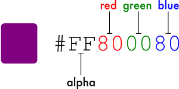
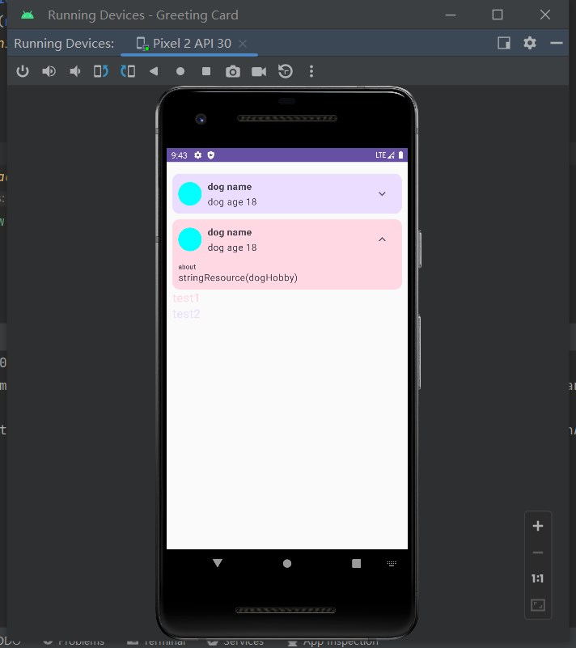

# 构建好看的app

## 使用jetpack Compose 进行物料主题化

- 颜色

<p>
  
</p>

前面两个字母代表透明度，如果没有，默认100%， #00表示0%透明度， #FF表示100%透明度

两个表示红色，两个表示绿色，两个表示蓝色（RGB）

- tap bar使用
```java
import androidx.compose.material3.CenterAlignedTopAppBar

@Composable
fun WoofTopAppBar(modifier: Modifier = Modifier) {
    CenterAlignedTopAppBar(
        title = {
            Row(
                verticalAlignment = Alignment.CenterVertically
            ) {
                Image(
                    modifier = Modifier
                        .size(dimensionResource(R.dimen.image_size))
                        .padding(dimensionResource(R.dimen.padding_small)),
                    painter = painterResource(R.drawable.ic_woof_logo),

                    // Content Description is not needed here - image is decorative, and setting a
                    // null content description allows accessibility services to skip this element
                    // during navigation.

                    contentDescription = null
                )
                Text(
                    text = stringResource(R.string.app_name),
                    style = MaterialTheme.typography.displayLarge
                )
            }
        },
        modifier = modifier
    )
}

@Composable
fun WoofApp() {
    Scaffold(
        topBar = {
            WoofTopAppBar()
        }
    ) { it ->
        LazyColumn(contentPadding = it) {
            items(dogs) {
                DogItem(
                    dog = it,
                    modifier = Modifier.padding(dimensionResource(R.dimen.padding_small))
                )
            }
        }
    }
}
```

## jetpack Compose的简单动画

- icons的使用

1. 在`build.gradle.kts (Module :app)`文件，`dependencies{}`块里面，添加代码：
```java
implementation("androidx.compose.material:material-icons-extended")
```

2. 使用Icon compose
```java
@Preview(showBackground = true)
@Composable
fun AffirmationsApp() {
    var expanded by remember { mutableStateOf(false) }

    Box(
        modifier = Modifier
            .fillMaxSize()
            .padding(10.dp),
    ) {
        Card {
            Column {
                Row(verticalAlignment = Alignment.CenterVertically, modifier = Modifier
                    .fillMaxWidth()
                    .padding(vertical = 10.dp, horizontal = 4.dp)) {
                    Surface(
                        modifier = Modifier.size(40.dp),
                        shape = CircleShape,
                        color = Color.Cyan
                    ) {}
                    DogInformation()
                    Spacer(modifier = Modifier.weight(1f))
                    DogItemButton(expanded = expanded, onClick = { /*TODO*/ })
                }
            }
        }

    }
}
@Composable
fun DogInformation() {
    Column(modifier = Modifier.padding(start = 10.dp)) {
        Text(text = "dog name", fontWeight = FontWeight.Bold, modifier = Modifier.padding(bottom = 4.dp))
        Text(text = "dog age 18")
    }
}

@Composable
fun DogItemButton(expanded: Boolean, onClick: () -> Unit, modifier: Modifier = Modifier) {
    IconButton(
        onClick = onClick,
        modifier = modifier
    ) {
        Icon(
            imageVector = Icons.Filled.ExpandMore,
            contentDescription = "more",
            tint = MaterialTheme.colorScheme.secondary
        )
    }
}


```

> 使用`Modifier.weight`去填充空间

3. 使用animateContentSize

<p>
  
</p>

```java
package com.example.greetingcard

class MainActivity : ComponentActivity() {
    override fun onCreate(savedInstanceState: Bundle?) {
        super.onCreate(savedInstanceState)
        setContent {
            GreetingCardTheme {
                AffirmationsApp()
            }
        }
    }
}

@Preview(showBackground = true)
@Composable
fun AffirmationsApp() {
    Box(
        modifier = Modifier
            .fillMaxSize()
            .padding(10.dp),
    ) {
        Column {
            DogItem()
            DogItem()
            Text(text = "test1", color = MaterialTheme.colorScheme.tertiaryContainer, fontSize = 20.sp)

            Text(text = "test2", color = MaterialTheme.colorScheme.primaryContainer, fontSize = 20.sp)
        }

    }
}

@Composable
fun DogItem() {
    var expanded by remember { mutableStateOf(false) }
    val tartColor by animateColorAsState(
        targetValue = if (expanded) MaterialTheme.colorScheme.tertiaryContainer else MaterialTheme.colorScheme.primaryContainer,
        label = "colorTest"
    )

    Card(modifier = Modifier.padding(top = 10.dp)) {
        Column(modifier = Modifier
            .animateContentSize(
                animationSpec = spring(
                    dampingRatio = Spring.DampingRatioNoBouncy,
                    stiffness = Spring.StiffnessMedium
                )
            )
            .background(color = tartColor)
        ) {
            Row(verticalAlignment = Alignment.CenterVertically, modifier = Modifier
                .fillMaxWidth()
                .padding(10.dp)) {
                Surface(
                    modifier = Modifier.size(40.dp),
                    shape = CircleShape,
                    color = Color.Cyan
                ) {}
                DogInformation()
                Spacer(modifier = Modifier.weight(1f))
                DogItemButton(expanded = expanded, onClick = { expanded = !expanded })
            }
            if (expanded) {
                DogHobby()
            }

        }
    }
}
@Composable
fun DogHobby() {
    Column(modifier = Modifier.padding(top = 5.dp, bottom = 10.dp, start = 10.dp)) {
        Text(
            text = "about",
            style = MaterialTheme.typography.labelSmall
        )
        Text(
            text = "stringResource(dogHobby)",
            style = MaterialTheme.typography.bodyLarge
        )
    }
}

@Composable
fun DogInformation() {
    Column(modifier = Modifier.padding(start = 10.dp)) {
        Text(text = "dog name", fontWeight = FontWeight.Bold, modifier = Modifier.padding(bottom = 4.dp))
        Text(text = "dog age 18")
    }
}

@Composable
fun DogItemButton(expanded: Boolean, onClick: () -> Unit, modifier: Modifier = Modifier) {
    IconButton(
        onClick = onClick,
        modifier = modifier
    ) {
        Icon(
            imageVector = if (expanded) Icons.Filled.ExpandLess else Icons.Filled.ExpandMore,
            contentDescription = "more",
            tint = MaterialTheme.colorScheme.secondary
        )
    }
}


```