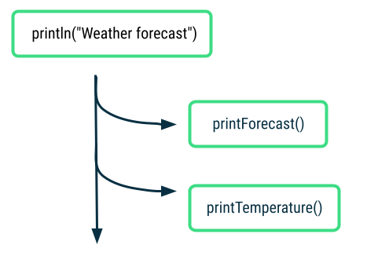

# 连接网络

## Kotlin 协程入门实验

1. 延期执行

```java
import kotlinx.coroutines.*

fun main() {
   runBlocking {
        println("Weather forecast")
        delay(1000)
        println("Sunny")
    }
}

/* 
一秒之后同时输出

Weather forecast
Sunny

*/
```

2. Suspending 函数
```java
import kotlinx.coroutines.*

fun main() {
    runBlocking {
        println("Weather forecast")
        printForecast()
    }
}

suspend fun printForecast() {
    delay(1000)
    println("Sunny")
}
```

3. 同时异步

```java
import kotlinx.coroutines.*

fun main() {
    runBlocking {
        println("Weather forecast")
        launch {
            printForecast()
        }
        launch {
            printTemperature()
        }
    }
}

suspend fun printForecast() {
    delay(1000)
    println("Sunny")
}

suspend fun printTemperature() {
    delay(1000)
    println("30\u00b0C")
} 
```

<p>
  
</p>

4. acynce 和awaite
```java
import kotlinx.coroutines.*

fun main() {
    runBlocking {
        println("Weather forecast")
        val forecast: Deferred<String> = async {
            getForecast()
        }
        val temperature: Deferred<String> = async {
            getTemperature()
        }
        println("${forecast.await()} ${temperature.await()}")
        println("Have a good day!")
    }
}

suspend fun getForecast(): String {
    delay(1000)
    return "Sunny"
}

suspend fun getTemperature(): String {
    delay(1000)
    return "30\u00b0C"
}
```

5.平行分解

```java
import kotlinx.coroutines.*

fun main() {
    runBlocking {
        println("Weather forecast")
        println(getWeatherReport())
        println("Have a good day!")
    }
}

suspend fun getWeatherReport() = coroutineScope {
    val forecast = async { getForecast() }
    val temperature = async { getTemperature() }
    "${forecast.await()} ${temperature.await()}"
}

suspend fun getForecast(): String {
    delay(1000)
    return "Sunny"
}

suspend fun getTemperature(): String {
    delay(1000)
    return "30\u00b0C"
}

/**
Weather forecast
Sunny 30°C
Have a good day!
*/
```

6. 异常和取消
```java
import kotlinx.coroutines.*

fun main() {
    runBlocking {
        println("Weather forecast")
        println(getWeatherReport())
        println("Have a good day!")
    }
}

suspend fun getWeatherReport() = coroutineScope {
    val forecast = async { getForecast() }
    val temperature = async {
        try {
            getTemperature()
        } catch (e: AssertionError) {
            println("Caught exception $e")
            "{ No temperature found }"
        }
    }

    "${forecast.await()} ${temperature.await()}"
}

suspend fun getForecast(): String {
    delay(1000)
    return "Sunny"
}

suspend fun getTemperature(): String {
    delay(500)
    throw AssertionError("Temperature is invalid")
    return "30\u00b0C"
}

/**
Weather forecast
Caught exception java.lang.AssertionError: Temperature is invalid
Sunny { No temperature found }
Have a good day!
*/
```

- 取消

```java
import kotlinx.coroutines.*

fun main() {
    runBlocking {
        println("Weather forecast")
        println(getWeatherReport())
        println("Have a good day!")
    }
}

suspend fun getWeatherReport() = coroutineScope {
    val forecast = async { getForecast() }
    val temperature = async { getTemperature() }

    delay(200)
    temperature.cancel()

    "${forecast.await()}"
}

suspend fun getForecast(): String {
    delay(1000)
    return "Sunny"
}

suspend fun getTemperature(): String {
    delay(1000)
    return "30\u00b0C"
}
```

## 在android studio中的协程

实例代码：https://github.com/google-developer-training/basic-android-kotlin-compose-training-race-tracker.git 

```java
package com.example.greetingcard

import android.util.Log
import androidx.compose.runtime.getValue
import androidx.compose.runtime.mutableStateOf
import androidx.compose.runtime.setValue
import kotlinx.coroutines.CancellationException
import kotlinx.coroutines.delay

class RaceParticipant(
    val name: String,
    val maxProgress: Int = 100,
    val progressDelayMillis: Long = 500L,
    private val progressIncrement: Int = 1,
    private val initialProgress: Int = 0
) {
    init {
        require(maxProgress > 0) { "maxProgress=$maxProgress; must be > 0" }
        require(progressIncrement > 0) { "progressIncrement=$progressIncrement; must be > 0" }
    }

    var currentProgress by mutableStateOf(initialProgress)
        private set

    suspend fun run() {
        try {
            while (currentProgress < maxProgress) {
                delay(progressDelayMillis)
                currentProgress += progressIncrement
            }
        } catch (e: CancellationException) {
            Log.e("RaceParticipant", "$name: ${e.message}")
            throw e // Always re-throw CancellationException.
        }
    }
    fun reset() {
        currentProgress = 0
    }
}

val RaceParticipant.progressFactor: Float
    get() = currentProgress / maxProgress.toFloat()

```

```java
@Composable
fun RaceTrackerApp() {
    /**
     * Note: To survive the configuration changes such as screen rotation, [rememberSaveable] should
     * be used with custom Saver object. But to keep the example simple, and keep focus on
     * Coroutines that implementation detail is stripped out.
     */
    val playerOne = remember {
        RaceParticipant(name = "Player 1", progressIncrement = 1)
    }
    val playerTwo = remember {
        RaceParticipant(name = "Player 2", progressIncrement = 2)
    }
    var raceInProgress by remember { mutableStateOf(false) }

    if (raceInProgress) {
        LaunchedEffect(playerOne, playerTwo) {
            coroutineScope {
                launch { playerOne.run() }
                launch { playerTwo.run() }
            }
            raceInProgress = false
        }
    }
    RaceTrackerScreen(
        playerOne = playerOne,
        playerTwo = playerTwo,
        isRunning = raceInProgress,
        onRunStateChange = { raceInProgress = it },
        modifier = Modifier
            .statusBarsPadding()
            .fillMaxSize()
            .verticalScroll(rememberScrollState())
            .safeDrawingPadding()
            .padding(horizontal = dimensionResource(R.dimen.padding_medium)),
    )
}
```

### 单元测试

1. 在app模块的`build.gradle.kts`文件，添加依赖
```java
dependencies {
    ...
    testImplementation("org.jetbrains.kotlinx:kotlinx-coroutines-test:1.6.4")
}
```

2. 测试RaceParticipant类
```java
package com.example.greetingcard

import junit.framework.TestCase.assertEquals
import kotlinx.coroutines.launch
import kotlinx.coroutines.test.advanceTimeBy
import kotlinx.coroutines.test.runCurrent
import kotlinx.coroutines.test.runTest
import org.junit.Test

class RaceParticipantTest {
    private val raceParticipant = RaceParticipant(name = "test")

    @Test
    fun raceParticipant_RaceStarted_ProgressUpdated() = runTest {
        val expectedProgress = 1
        launch { raceParticipant.run() }
        advanceTimeBy(raceParticipant.progressDelayMillis)
        runCurrent()

        assertEquals(expectedProgress, raceParticipant.currentProgress)
    }

    @Test
    fun raceParticipant_RaceFinished_ProgressUpdated() = runTest {
        launch { raceParticipant.run() }
        advanceTimeBy(raceParticipant.maxProgress * raceParticipant.progressDelayMillis)
        runCurrent()

        assertEquals(100, raceParticipant.currentProgress)
    }
}
```