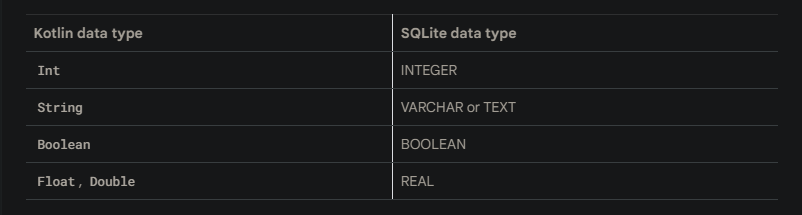

# 数据持续化

代码实例：https://github.com/google-developer-training/android-basics-kotlin-sql-basics-app/tree/main

## SQLite数据类型

<p>
  
</p>

## 创建数据库
```java
//InventoryDatabase.kt
package com.example.inventory.data

import android.content.Context
import androidx.room.Database
import androidx.room.Room
import androidx.room.RoomDatabase

@Database(entities = [Item::class], version = 1, exportSchema = false)
abstract class InventoryDatabase : RoomDatabase() {
    abstract fun itemDao(): ItemDao

    companion object {
        @Volatile
        private var Instance: InventoryDatabase? = null

        fun getDatabase(context: Context): InventoryDatabase {
            return Instance ?: synchronized(this) {
                Room.databaseBuilder(context, InventoryDatabase::class.java, "item_database")
                    .build()
                    .also { Instance = it }
            }
        }
    }

}

// item

package com.example.inventory.data

import androidx.room.Entity
import androidx.room.PrimaryKey


/**
 * Entity data class represents a single row in the database.
 */
@Entity(tableName = "items")
data class Item(
    @PrimaryKey(autoGenerate = true)
    val id: Int = 0,
    val name: String,
    val price: Double,
    val quantity: Int
)


// ItemsRepository
package com.example.inventory.data

import kotlinx.coroutines.flow.Flow

/**
 * Repository that provides insert, update, delete, and retrieve of [Item] from a given data source.
 */
interface ItemsRepository {
    /**
     * Retrieve all the items from the the given data source.
     */
    fun getAllItemsStream(): Flow<List<Item>>

    /**
     * Retrieve an item from the given data source that matches with the [id].
     */
    fun getItemStream(id: Int): Flow<Item?>

    /**
     * Insert item in the data source
     */
    suspend fun insertItem(item: Item)

    /**
     * Delete item from the data source
     */
    suspend fun deleteItem(item: Item)

    /**
     * Update item in the data source
     */
    suspend fun updateItem(item: Item)
}


// OfflineItemsRepository
package com.example.inventory.data

import kotlinx.coroutines.flow.Flow

class OfflineItemsRepository(private val itemDao: ItemDao) : ItemsRepository {
    override fun getAllItemsStream(): Flow<List<Item>> = itemDao.getAllItems()

    override fun getItemStream(id: Int): Flow<Item?> = itemDao.getItem(id)

    override suspend fun insertItem(item: Item) = itemDao.insert(item)

    override suspend fun deleteItem(item: Item) = itemDao.delete(item)

    override suspend fun updateItem(item: Item) = itemDao.update(item)
}
```