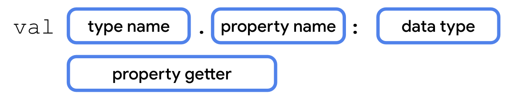
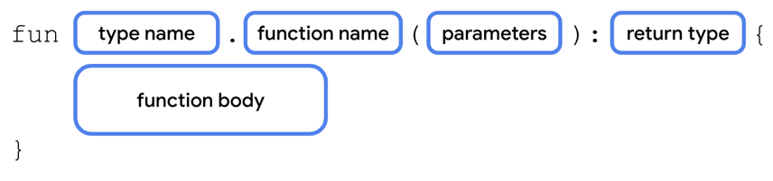

# kotlin进阶

## 泛型

```java
class Question<T>(
    val questionText: String,
    val answer: T,
    val difficulty: String
)

fun main() {
    val question1 = Question<String>("Quoth the raven ___", "nevermore", "medium")
    val question2 = Question<Boolean>("The sky is green. True or false", false, "easy")
    val question3 = Question<Int>("How many days are there between full moons?", 28, "hard")
}

```

## 使用枚举类

```java
enum class Difficulty(val label: String) {
    EASY("easy"),
    MEDIUM("medium"),
    HARD("hard")
}

class Question<T>(
    val questionText: String,
    val answer: T,
    val difficulty: Difficulty
)

val question1 = Question<String>("Quoth the raven ___", "nevermore", Difficulty.MEDIUM.label)
val question2 = Question<Boolean>("The sky is green. True or false", false, Difficulty.EASY.label)
val question3 = Question<Int>("How many days are there between full moons?", 28, Difficulty.HARD.label)

```

- valueOf 转换指定 name 为枚举值，若未匹配成功，会抛出IllegalArgumentException

```java
enum class CupcakeScreen(val title: String) {
    Start(title = "R.string.app_name"),
    Flavor(title = "R.string.choose_flavor"),
    Pickup(title = "R.string.choose_pickup_date"),
    Summary(title = "R.string.order_summary")
}
fun main() {
    val currentScreen = CupcakeScreen.valueOf("Start")
    println(currentScreen.Start)
}
```

## 使用数据类

但使用`data`关键字定义类的时候，下面的方法会实现了

- equals()

- hashCode()

- toString()

- componentN(): component1(), component2(), etc.

- copy()

```java
enum class Difficulty {
    EASY,
    MEDIUM,
    HARD
}

data class Question<T>(
    val questionText: String,
    val answer: T,
    val difficulty: Difficulty
)

fun main() {
    val question1 = Question<String>("Quoth the raven ___", "nevermore", Difficulty.MEDIUM)
    val question2 = Question<Boolean>("The sky is green. True or false", false, Difficulty.EASY)
    val question3 = Question<Int>("How many days are there between full moons?", 28, Difficulty.HARD)
    println(question1.toString())
    // Question(questionText=Quoth the raven ___, answer=nevermore, difficulty=MEDIUM)

}
```

## 使用单例对象

- 定义使用单例对象

```java
object StudentProgress {
    var total: Int = 10
    var answered: Int = 3
}

fun main() {
        println("${StudentProgress.answered} of ${StudentProgress.total} answered.")
}
```

- 定义同伴对象

可以通过类名去方法同伴对象的属性
```java
enum class Difficulty {
    EASY,
    MEDIUM,
    HARD
}

data class Question<T>(
    val questionText: String,
    val answer: T,
    val difficulty: Difficulty
)

class Quiz {
    val question1 = Question<String>("Quoth the raven ___", "nevermore", Difficulty.MEDIUM)
    val question2 = Question<Boolean>("The sky is green. True or false", false, Difficulty.EASY)
    val question3 = Question<Int>("How many days are there between full moons?", 28, Difficulty.HARD)

    companion object StudentProgress {
        var total: Int = 10
        var answered: Int = 3
    }
}

fun main() {
    println("${Quiz.answered} of ${Quiz.total} answered.")
}
```

## 扩展类的属性和方法

- 添加一个扩展属性

<p>
  
</p>

```java
class Quiz {
    val question1 = Question<String>("Quoth the raven ___", "nevermore", Difficulty.MEDIUM)
    val question2 = Question<Boolean>("The sky is green. True or false", false, Difficulty.EASY)
    val question3 = Question<Int>("How many days are there between full moons?", 28, Difficulty.HARD)

    companion object StudentProgress {
        var total: Int = 10
        var answered: Int = 3
    }
    
    
}
val Quiz.StudentProgress.progressText: String
      get() = "${answered} of ${total} answered"

fun main() {
    println(Quiz.progressText)
}

```

- 添加一个扩展函数

<p>
  
</p>

```java
enum class Difficulty {
    EASY,
    MEDIUM,
    HARD
}

data class Question<T>(
    val questionText: String,
    val answer: T,
    val difficulty: Difficulty
)

class Quiz {
    val question1 = Question<String>("Quoth the raven ___", "nevermore", Difficulty.MEDIUM)
    val question2 = Question<Boolean>("The sky is green. True or false", false, Difficulty.EASY)
    val question3 = Question<Int>("How many days are there between full moons?", 28, Difficulty.HARD)

    companion object StudentProgress {
        var total: Int = 10
        var answered: Int = 3
    }
    
    
}
val Quiz.StudentProgress.progressText: String
      get() = "${answered} of ${total} answered"

fun Quiz.StudentProgress.printProgressBar() {
    repeat(Quiz.answered) { print("▓") }
    repeat(Quiz.total - Quiz.answered) { print("▒") }
    println()
    println(Quiz.progressText)
}

fun main() {
    Quiz.printProgressBar()
}
```

2. 正常的扩展类的方法
```
class Quiz {
    val question1 = 1
    val question2 = 2
    val question3 = 3
}

fun Quiz.test() {
    println("Test")
}

fun main() {
    val quiz = Quiz() // 创建 Quiz 类的实例
    quiz.test() // 在实例上调用扩展函数
}

```

## 用接口重写扩展函数

```java
enum class Difficulty {
    EASY,
    MEDIUM,
    HARD
}

data class Question<T>(
    val questionText: String,
    val answer: T,
    val difficulty: Difficulty
)
interface ProgressPrintable {
    val progressText: String
    fun printProgressBar()
}
class Quiz:ProgressPrintable {
    val question1 = Question<String>("Quoth the raven ___", "nevermore", Difficulty.MEDIUM)
    val question2 = Question<Boolean>("The sky is green. True or false", false, Difficulty.EASY)
    val question3 = Question<Int>("How many days are there between full moons?", 28, Difficulty.HARD)

    companion object StudentProgress {
        var total: Int = 10
        var answered: Int = 3
    }
    
    override val progressText: String
        get() = "${answered} of ${total} answered"
    
    override fun printProgressBar() {
      repeat(Quiz.answered) { print("▓") }
      repeat(Quiz.total - Quiz.answered) { print("▒") }
      println()
      println(progressText)
    }
}
// val Quiz.StudentProgress.progressText: String
//       get() = "${answered} of ${total} answered"

// fun Quiz.StudentProgress.printProgressBar() {
//     repeat(Quiz.answered) { print("▓") }
//     repeat(Quiz.total - Quiz.answered) { print("▒") }
//     println()
//     println(Quiz.progressText)
// }


fun main() {
    var a = Quiz()
    a.printProgressBar()
    
}
```

## 使用作用域函数访问类的属性和方法

- 用`let()`替换长的对象名字

```java
enum class Difficulty {
    EASY,
    MEDIUM,
    HARD
}

data class Question<T>(
    val questionText: String,
    val answer: T,
    val difficulty: Difficulty
)
interface ProgressPrintable {
    val progressText: String
    fun printProgressBar()
}
class Quiz:ProgressPrintable {
    val question1 = Question<String>("Quoth the raven ___", "nevermore", Difficulty.MEDIUM)
    val question2 = Question<Boolean>("The sky is green. True or false", false, Difficulty.EASY)
    val question3 = Question<Int>("How many days are there between full moons?", 28, Difficulty.HARD)

    companion object StudentProgress {
        var total: Int = 10
        var answered: Int = 3
    }
    
//     fun printQuiz() {
//         println(question1.questionText)
//         println(question1.answer)
//         println(question1.difficulty)
//         println()
//         println(question2.questionText)
//         println(question2.answer)
//         println(question2.difficulty)
//         println()
//         println(question3.questionText)
//         println(question3.answer)
//         println(question3.difficulty)
//         println()
//     }
    // 改成let
    fun printQuiz() {
        question1.let {
            println(it.questionText)
            println(it.answer)
            println(it.difficulty)
        }
        println()
        question2.let {
            println(it.questionText)
            println(it.answer)
            println(it.difficulty)
        }
        println()
        question3.let {
            println(it.questionText)
            println(it.answer)
            println(it.difficulty)
        }
        println()
    }
    
}

fun main() {
    var a = Quiz()
    a.printQuiz()
    
}
```

- 用`apply()`，它会返回该类的实例

```java


fun main() {
    var a = Quiz()
    a.printQuiz()
}
// 替换成
fun main() {
  var a = Quiz().apply {
      printQuiz()
  }
}
```
