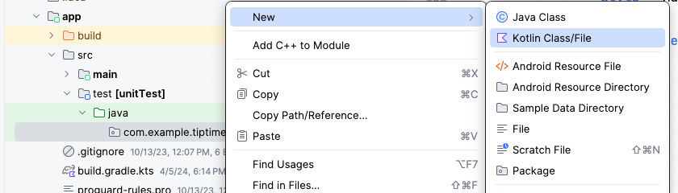
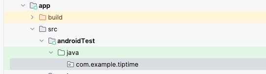
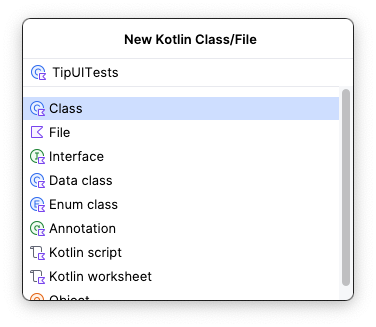

# 自动化测试

- 主要的断言函数
```java
// https://developer.android.com/reference/junit/framework/Assert
assertEquals()

assertNotEquals()

assertTrue()

assertFalse()

assertNull()

assertNotNull()

assertThat()

```

- 本地测试

1. 根据路径新建一个class类,命名为：`TipCalculatorTests`

<p>
  
</p>

2. 具体代码

```java
package com.example.greetingcard

import junit.framework.TestCase.assertEquals
import org.junit.Test
import java.text.NumberFormat

class TipCalculatorTests {

    @Test
    fun calculateTip_20PercentNoRoundup() {
        val amount = 10.00
        val tipPercent = 20.00
        val expectedTip = NumberFormat.getCurrencyInstance().format(2)

        val actualTip = calculateTip(amount = amount, tipPercent = tipPercent, false)
        assertEquals(expectedTip, actualTip)
    }
}
```

- 仪器化测试

1. 根据路径新建一个class类,命名为：`TipUiTests`

<p>
  
</p>
<p>
  
</p>

2. 具体代码

```java
package com.example.greetingcard

import androidx.compose.ui.test.junit4.createComposeRule
import androidx.compose.ui.test.onNodeWithText
import androidx.compose.ui.test.performTextInput
import com.example.greetingcard.ui.theme.GreetingCardTheme
import org.junit.Rule
import org.junit.Test
import java.text.NumberFormat

class TipUITests {

    @get:Rule
    val composeTestRule = createComposeRule()

    @Test
    fun calculate_20_percent_tip() {
        composeTestRule.setContent {
            GreetingCardTheme {
                TipTimeLayout()
            }
        }

        composeTestRule.onNodeWithText("Bill Amount").performTextInput("10")
        composeTestRule.onNodeWithText("Tip Percentage").performTextInput("20")

        val expectedTip = NumberFormat.getCurrencyInstance().format(2)
        composeTestRule.onNodeWithText("Tip Amount: $expectedTip").assertExists(
            "No node with this text was found."
        )
    }
}
```