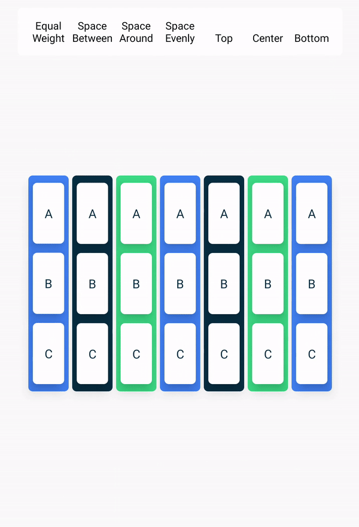
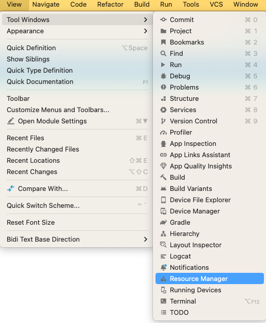
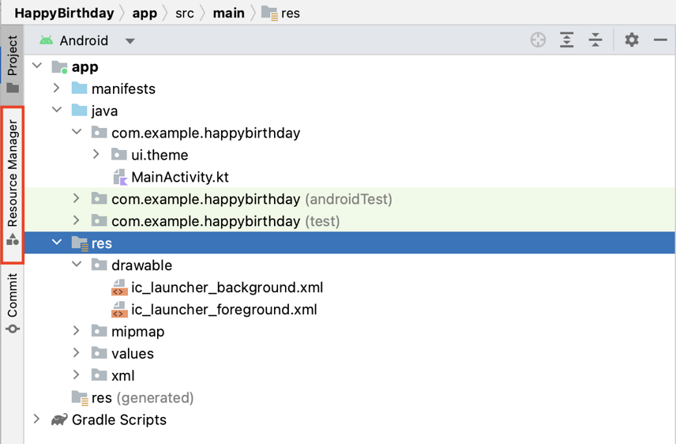
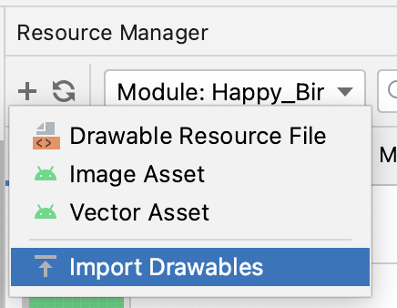
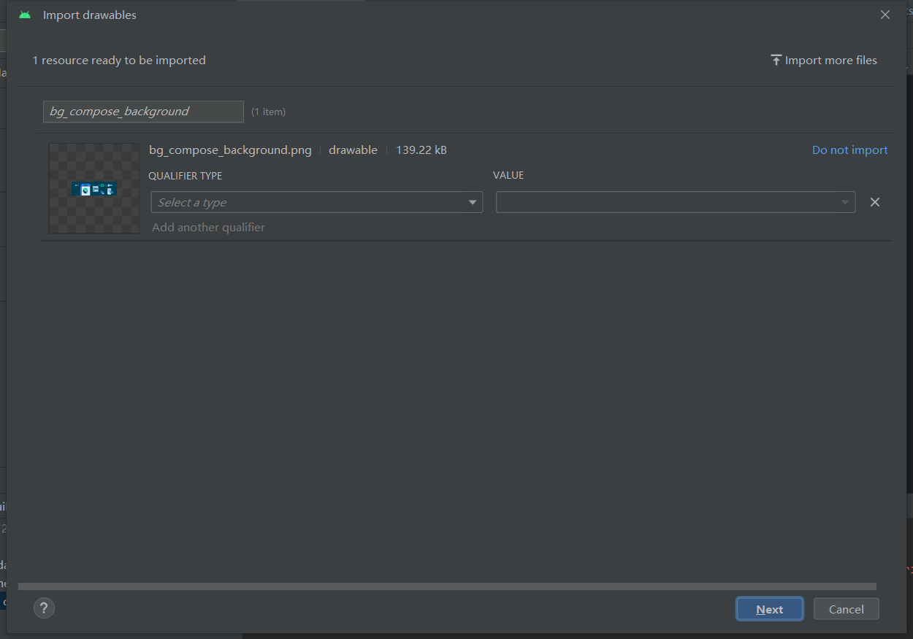

# 基础布局（basic layout）

## Jetpack Compose

一个构件安卓UI的工具包

Composable 函数特点

- 描述UI的一部分

- 没有返回值

- 接受输入和生成屏幕显示的内容

## 添加Text 元素

```kotlin
@Composable
fun GreetingText(message: String, modifier: Modifier = Modifier) {
    Text(
        text = message
    )
}
```

## 改变字体大小

默认情况下SP单位和DP单位是同样的。


```kotlin
@Composable
fun GreetingText(message: String, modifier: Modifier = Modifier) {
    Text(
        text = message,
        fontSize = 100.sp,
        lineHeight = 116.sp,
    )
}

GreetingText(
    message = stringResource(R.string.happy_birthday_text),
    from = stringResource(R.string.signature_text)
)
```

## 三个基础布局元素`Column`, `Row`和`Box`

1. Row元素的水平排列
<p>
  
</p>

2. Column元素的垂直排列
<p>
  
</p>


```
@Composable
fun GreetingText(message: String, from: String, modifier: Modifier = Modifier) {
    Row {
        Text(
            text = message,
            fontSize = 100.sp,
            lineHeight = 116.sp,
        )
        Text(
            text = from,
            fontSize = 36.sp
        )
    }
}

GreetingText(
    message = stringResource(R.string.happy_birthday_text),
    from = stringResource(R.string.signature_text)
)
```
### Image显示图片
1. 在`View` > `Tool Windows` > `Resource Manager` 或者`Resource Manager` tab ，点击`Import Drawables.`

<p>
  
  
  
</p>

2. 选择图片
 <p>
  
</p>

3. QUALTIFER TYPE选择`Density` ,VALUE选择`No Density`，点击`Next`

4. 点击`Improt`

```kotlin

val image = painterResource(R.drawable.androidparty)
Image(
    painter = image,
    contentDescription = null,
    contentScale = ContentScale.Crop,
    alpha = 0.5F
)
```

### Trailing lambda syntax

Kotlin提供一个特别语法：当最后一个参数是函数，把函数作为参数传给函数

当你通过函数作为参数，你可以用`Trailing lambda`语法，而不是用圆括号，可以用花括号替代

```kotlin
Row(
    content = {
        Text("Some text")
        Text("Some more text")
        Text("Last text")
    }
)

// 一样
Row {
    Text("Some text")
    Text("Some more text")
    Text("Last text")
}
```


基础课程：https://developer.android.com/courses/android-basics-compose/course