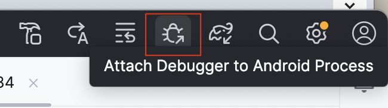
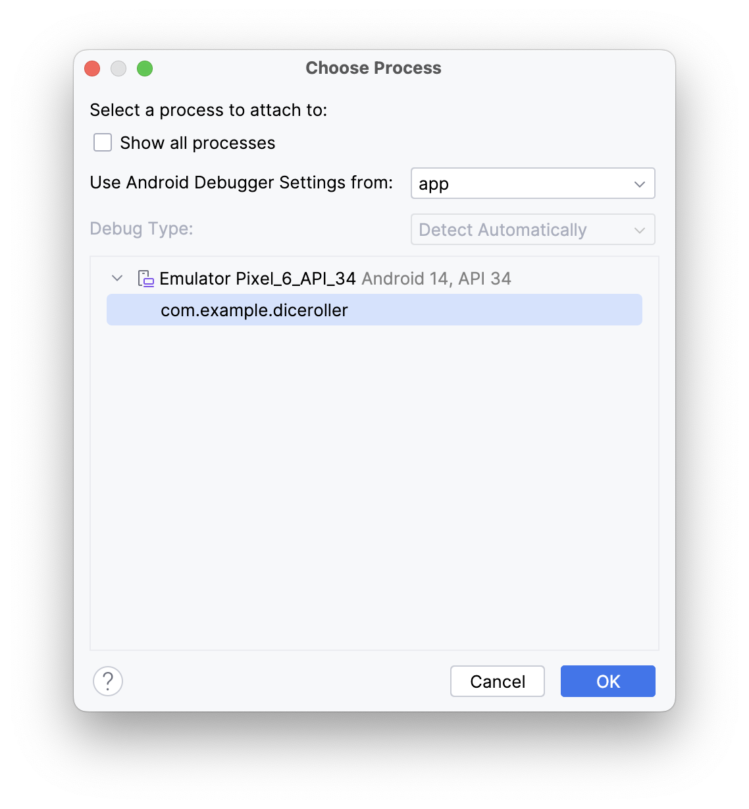
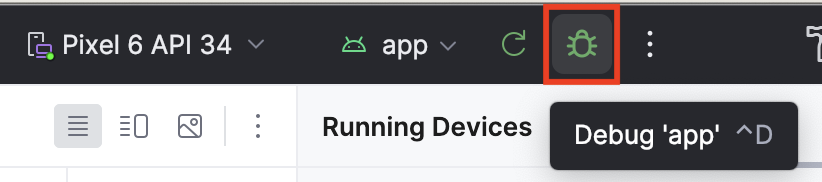
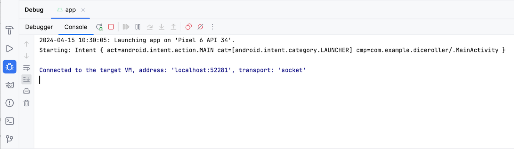
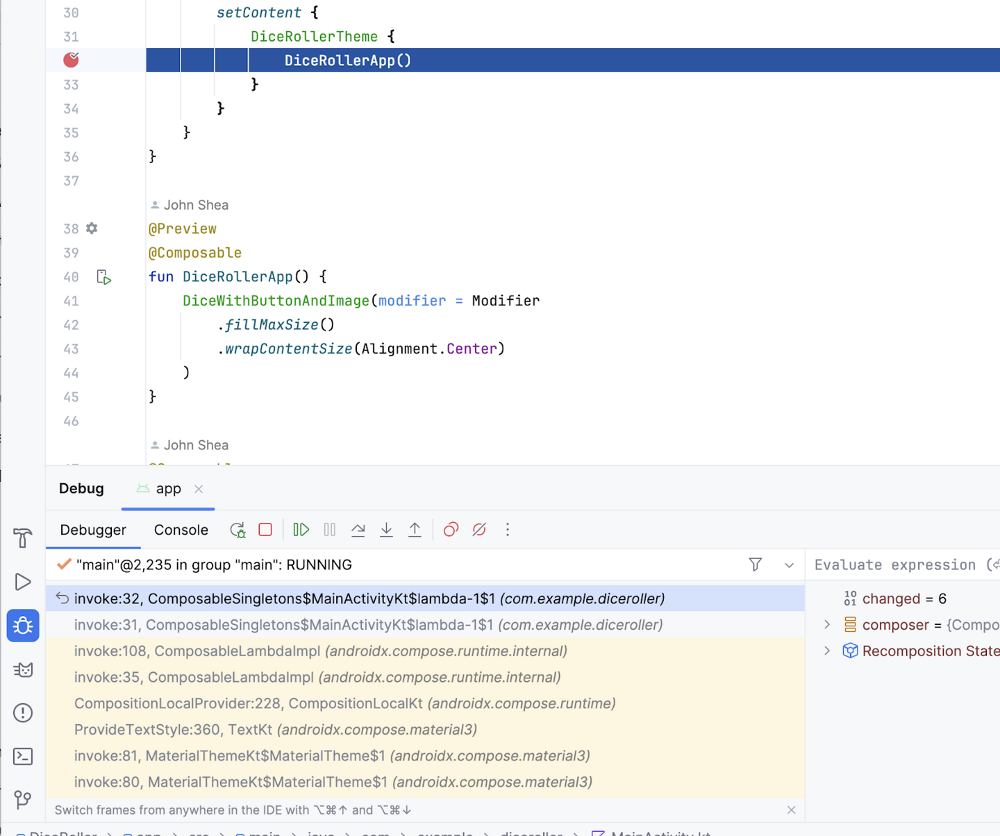

# 开发一个摇骰子App

## Spacer composable

Spacer(modifier = Modifier.height(16.dp))

一个空的空间布局，可以设置 Modifier.width, Modifier.height, Modifier.size

## 添加触发摇色子

- remember
默认情况下，可组合函数是无状态的，这表明他们无法通过系统保持一个值无法重新组合，当结果被重新设置的时候，
（意味着它们不存储值，并且可随时被系统重组，从而导致值被重置）
然而可组合函数可以用remember来保存对象在内存里面

- mutableStateOf
- mutableStateOf()函数返回可以观察函数，但`result`变量改变，触发重排，`reslut`的值重新映射，UI就会刷新

var result by remember { mutableStateOf(1) }


## 调试

用两种方式调试

- debugger依附在一个运行在设备或者模拟器的app程序上（将调试器附加到在设备或模拟器上运行的现有应用程序进程上）
1. 点击 `Attach Debugger to Android Process.`
<p>
  
</p>

2. 选择进程`com.example.xxx`

<p>
  
</p>

- debugger和app一起运行（用调试器运行应用程序。）

> 当你没用运行模拟器的时候

1. 点击`debugg app`
<p>
  
</p>

debug面板就就会显示在底部
<p>
  
</p>

2.如何使用debugger

 审查变量 在代码旁边点击断点，点击`debugg app`,运行app的时候，就会暂停在断点那里
<p>
  
</p>

```java
package com.example.greetingcard

//import androidx.compose.foundation.layout.RowScopeInstance.weight
import android.os.Bundle
import androidx.activity.ComponentActivity
import androidx.activity.compose.setContent
import androidx.compose.foundation.Image
import androidx.compose.foundation.background
import androidx.compose.foundation.layout.Column
import androidx.compose.foundation.layout.Spacer
import androidx.compose.foundation.layout.fillMaxSize
import androidx.compose.foundation.layout.height
import androidx.compose.foundation.layout.wrapContentSize
import androidx.compose.material3.Button
import androidx.compose.material3.Text
import androidx.compose.runtime.Composable
import androidx.compose.runtime.getValue
import androidx.compose.runtime.mutableStateOf
import androidx.compose.runtime.remember
import androidx.compose.runtime.setValue
import androidx.compose.ui.Alignment
import androidx.compose.ui.Modifier
import androidx.compose.ui.graphics.Color
import androidx.compose.ui.res.painterResource
import androidx.compose.ui.res.stringResource
import androidx.compose.ui.tooling.preview.Preview
import androidx.compose.ui.unit.dp
import androidx.compose.ui.unit.sp
import com.example.greetingcard.ui.theme.GreetingCardTheme


class MainActivity : ComponentActivity() {
    override fun onCreate(savedInstanceState: Bundle?) {
        super.onCreate(savedInstanceState)
        setContent {
            GreetingCardTheme {
                DiceRollerApp()
            }
        }
    }
}

@Preview
@Composable
fun DiceRollerApp() {
    DiceWithButtonAndImage(modifier = Modifier
        .fillMaxSize().background(Color.White)
        .wrapContentSize(Alignment.Center))
}

@Composable
fun DiceWithButtonAndImage(modifier: Modifier = Modifier) {
    var result by remember { mutableStateOf( 1) }

    val imageResource = when(result) {
        1 -> R.drawable.dice_1
        2 -> R.drawable.dice_2
        3 -> R.drawable.dice_3
        4 -> R.drawable.dice_4
        5 -> R.drawable.dice_5
        else -> R.drawable.dice_6
    }

    Column(modifier = modifier, horizontalAlignment = Alignment.CenterHorizontally) {
        Image(painter = painterResource(imageResource), contentDescription = imageResource.toString())
        Spacer(modifier = Modifier.height(16.dp))
        Button(onClick = { result = (1..6).random()  }) {
            Text(text = stringResource(R.string.roll), fontSize = 24.sp)
        }
    }
}
```