# android stdio安装和使用

## 下载和安装Android Studio

- 下载地址链接：
```
 https://developer.android.com/studio#get-android-studio
```

- 安装之后， `Tools` > `SDK Manager` 修改SKD保存路径，不然撑爆C盘

<p>
  
</p>

## 创建安卓项目

1. 在`Welcome to Android Studio `对话框，点击`New Project`,选择` Empty Activity`模板

<p>
  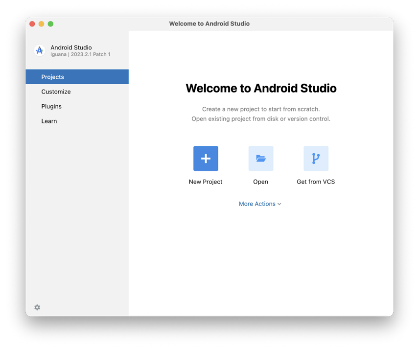
  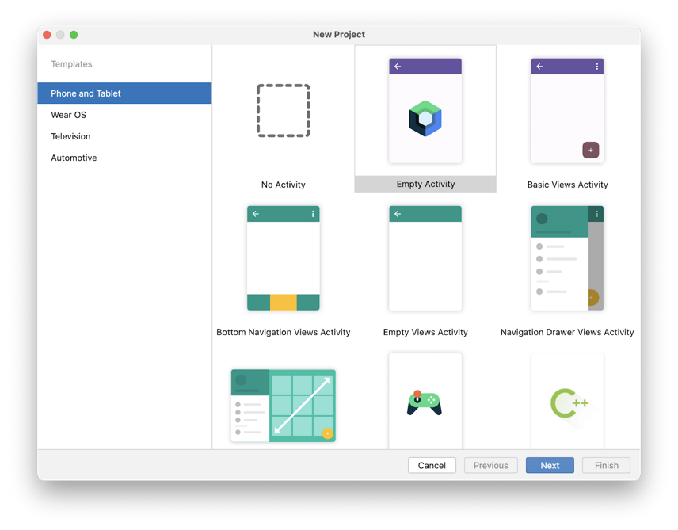
</p>

2. 类似下图配置初始项目
<p>
  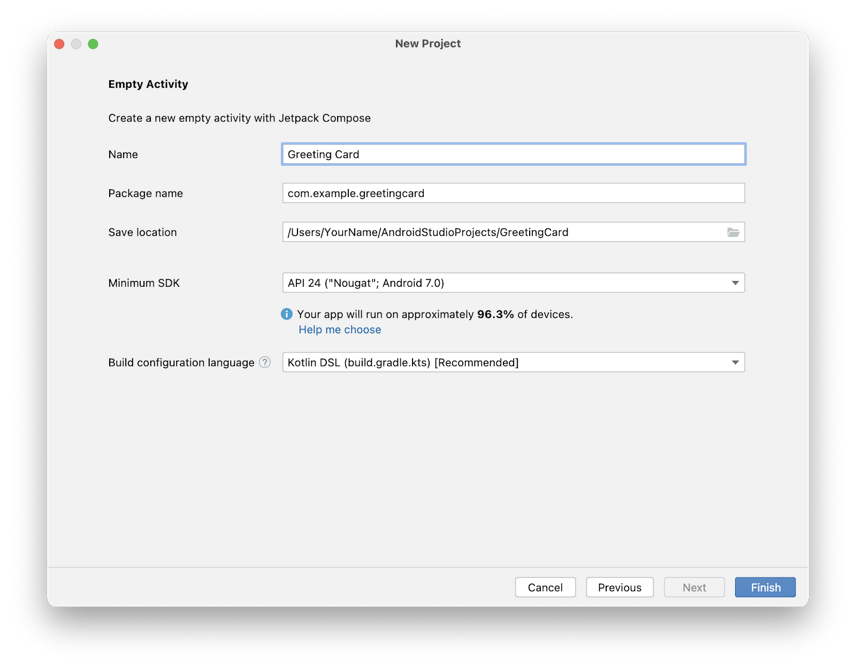
</p>

3. 在路径`xxx\gradle\wrapper\gradle-wrapper.properties`修改gradle下载路径,改成腾讯云镜像地址
```
#Sat Apr 20 11:27:12 CST 2024
distributionBase=GRADLE_USER_HOME
distributionPath=wrapper/dists
#distributionUrl=https\://services.gradle.org/distributions/gradle-8.0-bin.zip
distributionUrl=https\://mirrors.cloud.tencent.com/gradle/gradle-8.0-bin.zip
zipStoreBase=GRADLE_USER_HOME
zipStorePath=wrapper/dists
```

## 运行在安卓模拟器上面

1. 选择`Tools` > ` Device Manager`
<p>
  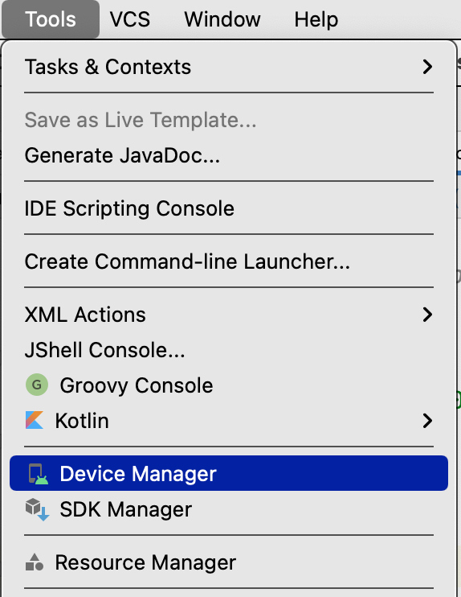
</p>

2. 点击`Create device`
<p>
  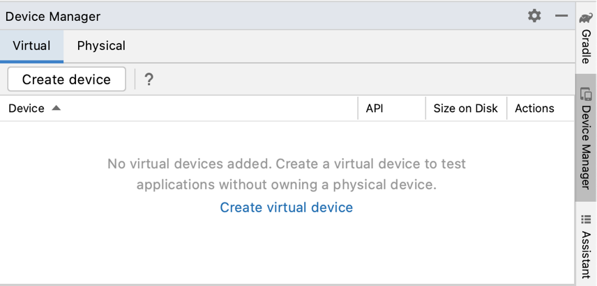
</p>

3. 虚拟设备配置对话框进行操作

- 选择`Phone`类目
<p>
  
</p>

- 点击`Next`
<p>
  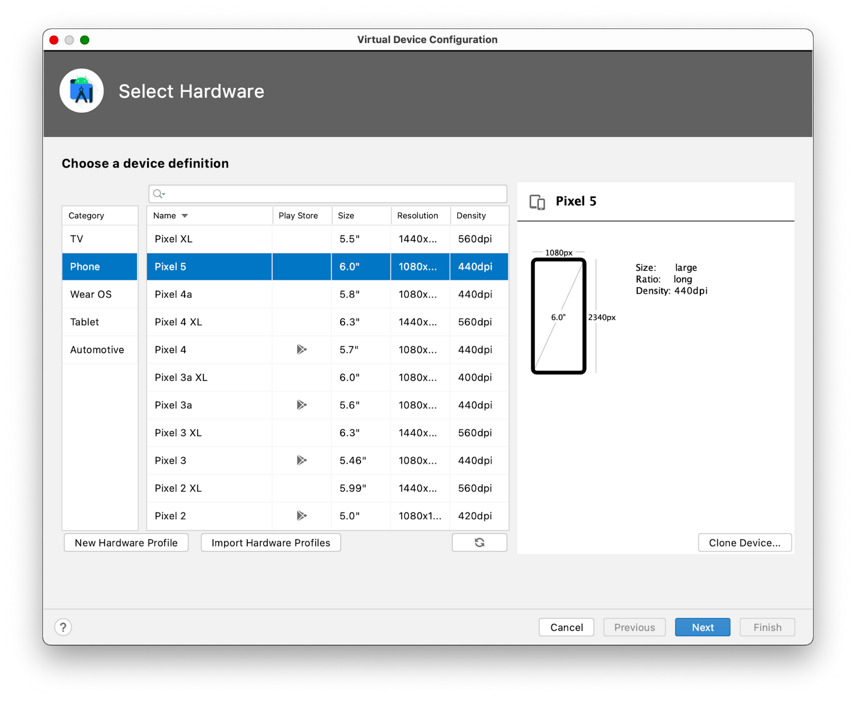
</p>


- 这时候就可以选择安卓版本了
<p>
  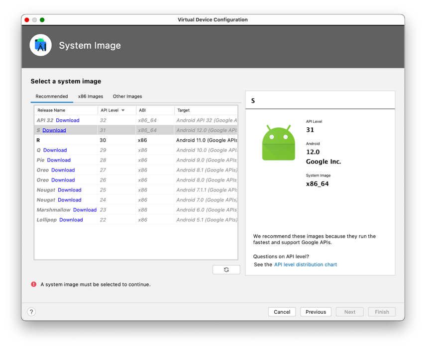
</p>

在`Recommended`框 选择`S`作为安卓版本，S表示安卓的最新版本

- 点击`Finish`
<p>
  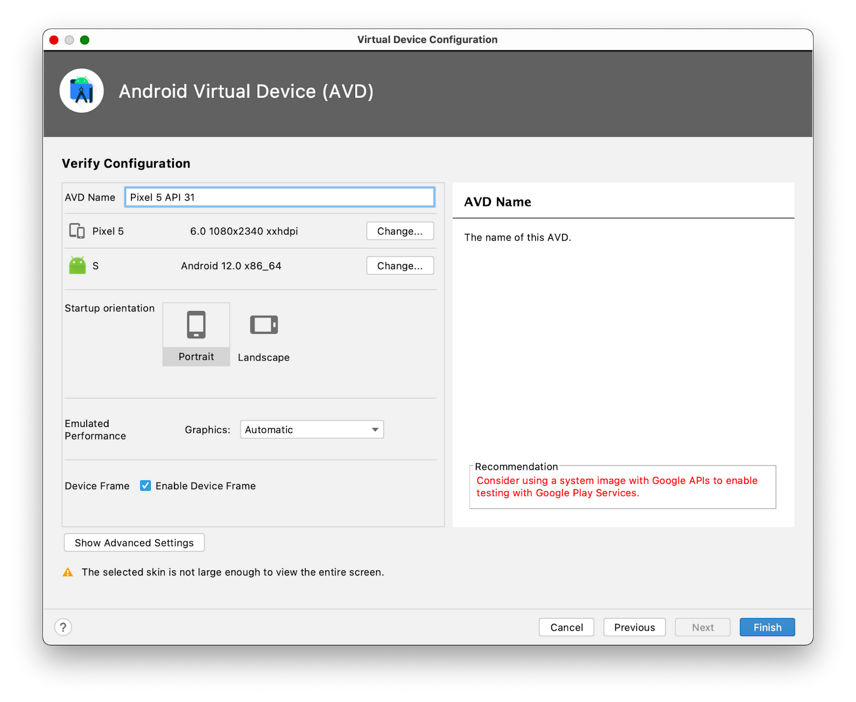
</p>

## 如何连接安卓设备

### 启用USB调试（根据手机型号）

1. 在`设置` > `关于手机`, 点击关于手机7次, 如果弹出提示，`你现在是一个开发者`，表示成功了

2. 在 `设置` > `系统` > `开发者选项`, 开启USB调试

<p>
  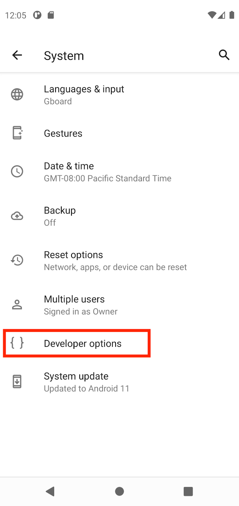
  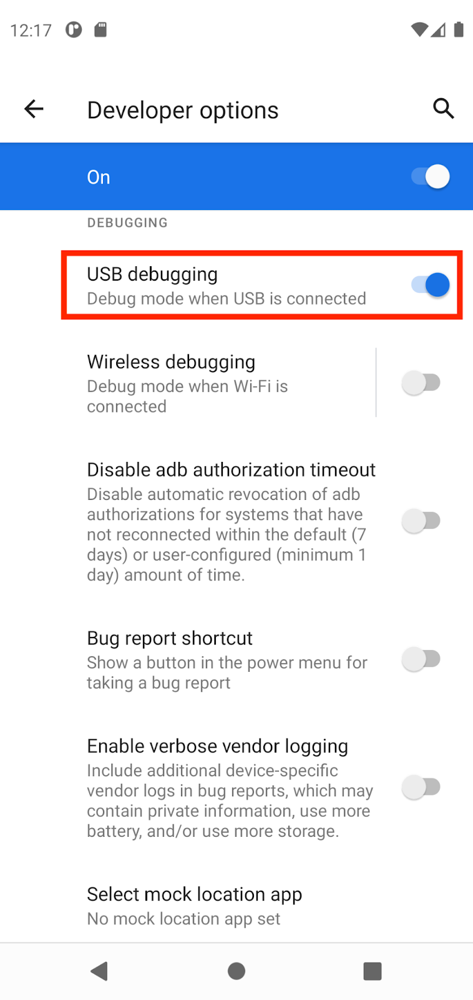
</p>

3. 安装`Google USE Driver`（win系统） 
  
  - 点击 `Tools` > ` SDK Manager`。在对话框选择 `Preferences` > `Appearance & Behavior` > `System Settings` > `Android SDK` 

  - 点击`SDK Tools`框

  - 选择`Google USB Driver` 如何点击`OK`

<p>
  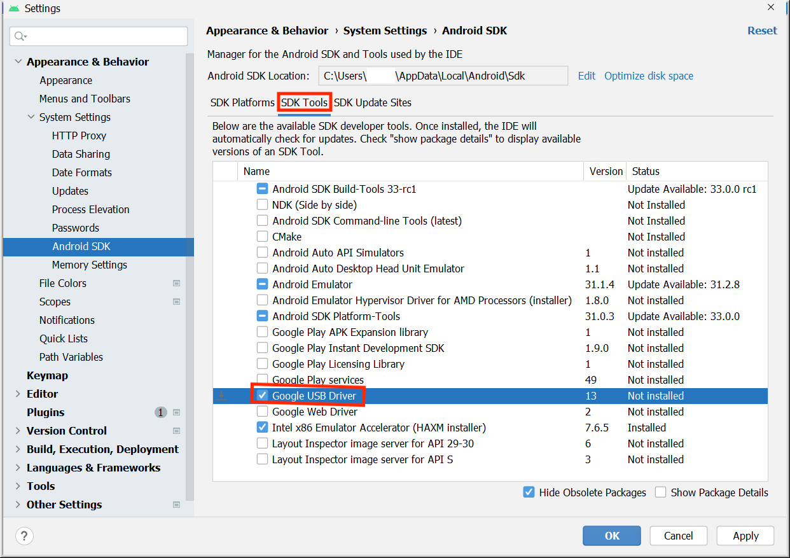
</p>

将会下载在`android_sdk\extras\google\usb_driver`目录


### 用连接线在安卓设备上运行app

1. 用USB连接线，连接手机和电脑。在对话框运行USB调试

<p>
  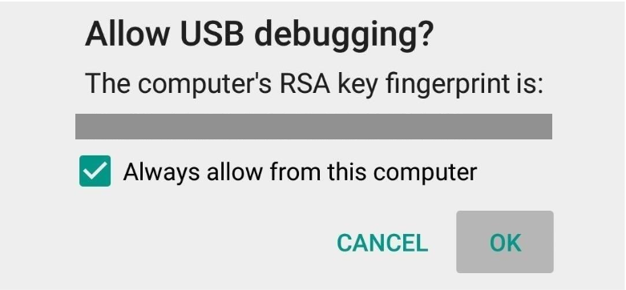
</p>

2. 在Android Studio上面，选择你的物理设备,点击运行

<p>
  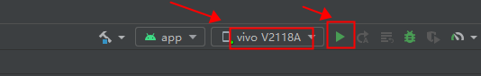
</p>
