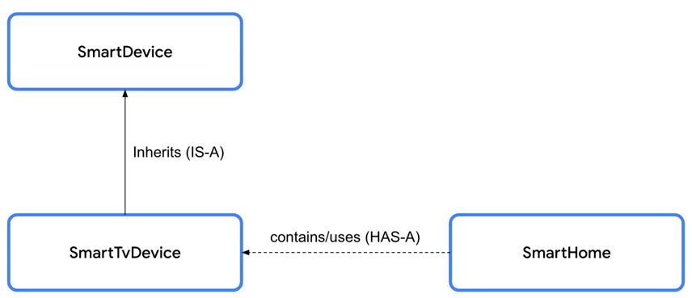
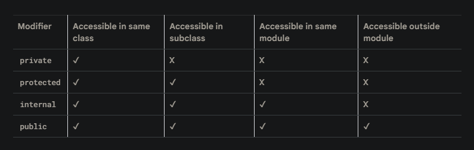

# kotlin语法

> kotlin语法运行在线网站 https://developer.android.com/training/kotlinplayground

## var和val的区别
- 在类中
`var`：可变属性可以在类的任何地方被修改
```java
class Person {
    var name: String = "John"
}

```
`val`：只读属性 一旦初始化后就无法再修改它的值。

```java
class Person {
    var name: String = "John"
}
```
## if/else 和when 条件语句

```Kotlin
// if的用法
fun main() {
    val trafficLightColor = "Yellow"

    if (trafficLightColor == "Red") {
        println("Stop")
    } else if (trafficLightColor == "Yellow") {
        println("Slow")
    } else {
        println("Go")
    }
}

// when的用法
fun main() {
    val trafficLightColor = "Black"

    when (trafficLightColor) {
        "Red" -> println("Stop")
        "Yellow" -> println("Slow")
        "Green" -> println("Go")
        else -> println("Invalid traffic-light color")
    }
}

```
## null的使用
```kotlin
// ？可以赋值null
fun main() {
    var favoriteActor: String? = "Sandra Oh"
    favoriteActor = null
}

// ?. 访问变量属性
fun main() {
    var favoriteActor: String? = "Sandra Oh"
    println(favoriteActor?.length)
}


// !! 断言为空

fun main() {
    var favoriteActor: String? = "Sandra Oh"
    println(favoriteActor!!.length)
}

// ?: 埃尔维斯运算符
fun main() {
    var favoriteActor: String? = "Sandra Oh"

    val lengthOfName = favoriteActor?.length ?: 0

    println("The number of characters in your favorite actor's name is $lengthOfName.")
}

// 等同于
fun main() {
    var favoriteActor: String? = "Sandra Oh"

    val lengthOfName = if (favoriteActor != null) {
      favoriteActor.length
    } else {
      0
    }

    println("The number of characters in your favorite actor's name is $lengthOfName.")
}
```


## 使用class和object

Encapsulation 封装性： 包含相关的属性和方法，比如手机封装照相，显示器，储存卡，软件

Abstraction 抽象性： 封装的扩展，隐藏了内部实现逻辑。比如用手机拍照，你只需要打开相机拍你想要的图片，不需要知道背后的工作

Inheritance 继承性： 通过父子关系，允许构建一个类根据其他类的特性和行为（使您能够在其他类的特征和行为基础上构建类）比如：

不同的制造商生产各种移动设备运行安卓系统，当是他们的UI是每个设备是不一样的，意思就是制造商继承了安卓系统的特性，并在此基础上进行定制。

Polymorphism 多态性： 以一种单一的、通用的方式使用不同对象的能力，比如：当你用手机连接一个蓝牙音箱，手机只需要知道这个设备可以通过蓝牙播放声音，然而你选择的各种各样的蓝牙音箱， 你的手机不需要知道他们每一个如何工作

- 一个类由三个部分组成
Properties 属性

Methods  方法

Constructors 构造函数  创建class的实例的特殊函数成员贯穿程序的定义（一个特殊的成员函数，它在定义类的整个程序中创建类的实例。）

2. getter和setter函数
```kotlin
var speakerVolume = 2
// 定义变量 背后的工作
    get() = field  
    set(value) {
        field = value    
    }
```

3. 定义构造函数
```kotlin
// 定义一个没用参数的构造函数
class SmartDevice constructor() {
    ...
}
// 简洁版
class SmartDevice {
    ...
}
 
// 定义一个参数化的构造函数
class SmartDevice(val name: String, val category: String) {

    var deviceStatus = "online"

    fun turnOn() {
        println("Smart device is turned on.")
    }

    fun turnOff() {
        println("Smart device is turned off.")
    }
}

SmartDevice("Android TV", "Entertainment")

SmartDevice(name = "Android TV", category = "Entertainment")

// 第二构造函数体 主构造函数的初始化后跟一组花括号，其中包含二级构造函数的主体。
class SmartDevice(val name: String, val category: String) {
    var deviceStatus = "online"

    constructor(name: String, category: String, statusCode: Int) : this(name, category) {
        deviceStatus = when (statusCode) {
            0 -> "offline"
            1 -> "online"
            else -> "unknown"
        }
    }
    ...
}
```

4. 实现类之间的关系
- IS-A 关系
使用继承建立的关系，对象是来自继承类的实例（对象也是它所继承的类的实例）

- HAS-A 关系
对象可以拥有其他类的实例，其他类的实例没有成为为类本身的实例（对象可以拥有另一个类的实例，而不必实际成为该类本身的实例）

```kotlin
// IS-A 关系
class SmartLightDevice(deviceName: String, deviceCategory: String) :
    SmartDevice(name = deviceName, category = deviceCategory) {
    ...
}
// IS-A 关系
class SmartTvDevice(deviceName: String, deviceCategory: String) :
    SmartDevice(name = deviceName, category = deviceCategory) {
    ...
}

// HAS-A 关系
class SmartHome(
    val smartTvDevice: SmartTvDevice,
    val smartLightDevice: SmartLightDevice
) {

    ...

    fun turnOffAllDevices() {
        turnOffTv()
        turnOffLight()
    }
}
```

<p>
  
</p>

```
// open关键字 指示编译器这个类可以扩展
open class SmartDevice(val name: String, val category: String) {

    var deviceStatus = "online"

    open fun turnOn() {
        // function body
    }

    open fun turnOff() {
        // function body
    }
}

class SmartLightDevice(deviceName: String, deviceCategory: String) :
    SmartDevice(name = deviceName, category = deviceCategory) {

    var brightnessLevel = 0
        set(value) {
            if (value in 0..100) {
                field = value
            }
        }

    fun increaseBrightness() {
        brightnessLevel++
        println("Brightness increased to $brightnessLevel.")
    }

    override fun turnOn() {
        deviceStatus = "on"
        brightnessLevel = 2
        println("$name turned on. The brightness level is $brightnessLevel.")
    }

    override fun turnOff() {
        deviceStatus = "off"
        brightnessLevel = 0
        println("Smart Light turned off")
    }
}
```


5. 修饰器 
- public 默认可见修饰器，声明都可以访问，属性和方法在外部都用
- private, 只能在类里面可以访问
- projected 可以在子类访问
- internal 可以在模块访问

<p>
  
</p>

6. 定义属性委托

通过by关键字定义,将属性的 getter 和 setter 委托给另一个对象

-现委托的类需要提供以下方法：
`getValue()`：用于处理属性的 getter 方法。
`setValue()`：用于处理属性的 setter 方法（如果属性是可变的）。

```java
class RangeRegulator(
    initialValue: Int,
    private val minValue: Int,
    private val maxValue: Int
) : ReadWriteProperty<Any?, Int> {

    var fieldData = initialValue

    override fun getValue(thisRef: Any?, property: KProperty<*>): Int {
        return fieldData
    }

    override fun setValue(thisRef: Any?, property: KProperty<*>, value: Int) {
        if (value in minValue..maxValue) {
            fieldData = value
        }
    }
}

class SmartTvDevice(deviceName: String, deviceCategory: String) :
    SmartDevice(name = deviceName, category = deviceCategory) {

    override val deviceType = "Smart TV"

    private var speakerVolume by RangeRegulator(initialValue = 2, minValue = 0, maxValue = 100)

    private var channelNumber by RangeRegulator(initialValue = 1, minValue = 0, maxValue = 200)

    ...

}

class SmartLightDevice(deviceName: String, deviceCategory: String) :
    SmartDevice(name = deviceName, category = deviceCategory) {

    override val deviceType = "Smart Light"

    private var brightnessLevel by RangeRegulator(initialValue = 0, minValue = 0, maxValue = 100)

    ...

}
```

## 总结代码
```java
import kotlin.properties.ReadWriteProperty
import kotlin.reflect.KProperty

open class SmartDevice(val name: String, val category: String) {

    var deviceStatus = "online"
        protected set

    open val deviceType = "unknown"

    open fun turnOn() {
        deviceStatus = "on"
    }

    open fun turnOff() {
        deviceStatus = "off"
    }
}

class SmartTvDevice(deviceName: String, deviceCategory: String) :
    SmartDevice(name = deviceName, category = deviceCategory) {

    override val deviceType = "Smart TV"

    private var speakerVolume by RangeRegulator(initialValue = 2, minValue = 0, maxValue = 100)

    private var channelNumber by RangeRegulator(initialValue = 1, minValue = 0, maxValue = 200)

    fun increaseSpeakerVolume() {
        speakerVolume++
        println("Speaker volume increased to $speakerVolume.")
    }

    fun nextChannel() {
        channelNumber++
        println("Channel number increased to $channelNumber.")
    }

    override fun turnOn() {
        super.turnOn()
        println(
            "$name is turned on. Speaker volume is set to $speakerVolume and channel number is " +
                "set to $channelNumber."
        )
    }

    override fun turnOff() {
        super.turnOff()
        println("$name turned off")
    }
}

class SmartLightDevice(deviceName: String, deviceCategory: String) :
    SmartDevice(name = deviceName, category = deviceCategory) {

    override val deviceType = "Smart Light"

    private var brightnessLevel by RangeRegulator(initialValue = 0, minValue = 0, maxValue = 100)

    fun increaseBrightness() {
        brightnessLevel++
        println("Brightness increased to $brightnessLevel.")
    }

    override fun turnOn() {
        super.turnOn()
        brightnessLevel = 2
        println("$name turned on. The brightness level is $brightnessLevel.")
    }

    override fun turnOff() {
        super.turnOff()
        brightnessLevel = 0
        println("Smart Light turned off")
    }
}

class SmartHome(
    val smartTvDevice: SmartTvDevice,
    val smartLightDevice: SmartLightDevice
) {

    var deviceTurnOnCount = 0
        private set

    fun turnOnTv() {
        deviceTurnOnCount++
        smartTvDevice.turnOn()
    }

    fun turnOffTv() {
        deviceTurnOnCount--
        smartTvDevice.turnOff()
    }

    fun increaseTvVolume() {
        smartTvDevice.increaseSpeakerVolume()
    }

    fun changeTvChannelToNext() {
        smartTvDevice.nextChannel()
    }

    fun turnOnLight() {
        deviceTurnOnCount++
        smartLightDevice.turnOn()
    }

    fun turnOffLight() {
        deviceTurnOnCount--
        smartLightDevice.turnOff()
    }

    fun increaseLightBrightness() {
        smartLightDevice.increaseBrightness()
    }

    fun turnOffAllDevices() {
        turnOffTv()
        turnOffLight()
    }
}

class RangeRegulator(
    initialValue: Int,
    private val minValue: Int,
    private val maxValue: Int
) : ReadWriteProperty<Any?, Int> {

    var fieldData = initialValue

    override fun getValue(thisRef: Any?, property: KProperty<*>): Int {
        return fieldData
    }

    override fun setValue(thisRef: Any?, property: KProperty<*>, value: Int) {
        if (value in minValue..maxValue) {
            fieldData = value
        }
    }
}

fun main() {
    var smartDevice: SmartDevice = SmartTvDevice("Android TV", "Entertainment")
    smartDevice.turnOn()

    smartDevice = SmartLightDevice("Google Light", "Utility")
    smartDevice.turnOn()
}
```

## 使用函数类型和lambda表达式（拉姆达表达式）

- 保存一个函数在变量里面
```kotlin
fun main() {
    val trickFunction = ::trick

    trick()
}

fun trick() {
    println("No treats!")
}
```

- lambda表达式定义函数
```kotlin
fun main() {
    val trickFunction = trick
    trick()
}

val trick = {
    println("No treats!")
}
```

- 使用函数作为一个数据类型
```java
val treat: () -> Unit = {
    println("Have a treat!")
}

fun trickOrTreat(isTrick: Boolean): () -> Unit {
    if (isTrick) {
        return trick
    } else {
        return treat
    }
}

```

- 通过一个函数作为另一个函数的参数（将一个函数作为参数传递给另一个函数）
```java

fun trickOrTreat(isTrick: Boolean, extraTreat: (Int) -> String): () -> Unit {
    if (isTrick) {
        return trick
    } else {
        println(extraTreat(5))
        return treat
    }
}
fun main() {
    val coins: (Int) -> String = { quantity ->
        "$quantity quarters"
    }

    val cupcake: (Int) -> String = {
        "Have a cupcake!"
    }

    val treatFunction = trickOrTreat(false, coins)
    val trickFunction = trickOrTreat(true, cupcake)
    treatFunction()
    trickFunction()
}
```

- 空函数类型
```java
fun trickOrTreat(isTrick: Boolean, extraTreat: ((Int) -> String)?): () -> Unit {
    if (isTrick) {
        return trick
    } else {
        if (extraTreat != null) {
            println(extraTreat(5))
        }
        return treat
    }
}
```

- lambda表达式简写
```java
val coins: (Int) -> String = { quantity ->
    "$quantity quarters"
}

// 简写
val coins: (Int) -> String = {
    "$it quarters"
}
```

- lambda表示直接作为函数
```java
fun main() {
    val coins: (Int) -> String = {
        "$it quarters"
    }
    val treatFunction = trickOrTreat(false, coins)
    val trickFunction = trickOrTreat(true, null)
    treatFunction()
    trickFunction()
}

// 简写
fun main() {
    val treatFunction = trickOrTreat(false, { "$it quarters" })
    val trickFunction = trickOrTreat(true, null)
    treatFunction()
    trickFunction()
}
```

- 使用尾随lambda语法
```java
val treatFunction = trickOrTreat(false, { "$it quarters" })
// 简写
val treatFunction = trickOrTreat(false) { "$it quarters" }
```

- 使用repeat()函数
当一个函数返回一个新函数，或者把函数作为参数，称之为高阶函数，如 `repeat()`
```java
repeat(times: Int, action: (Int) -> Unit)
```
<p>
  
</p>